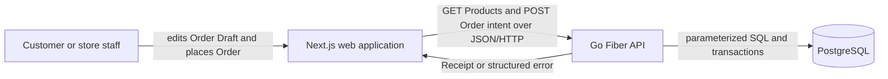
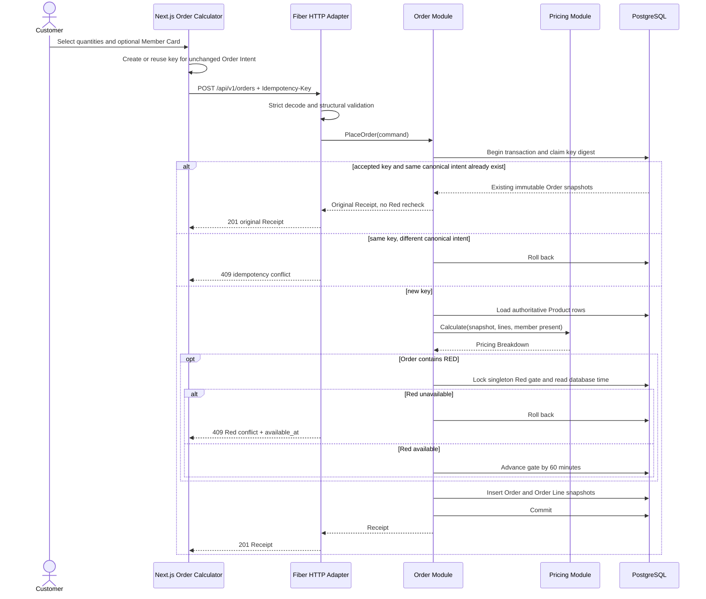
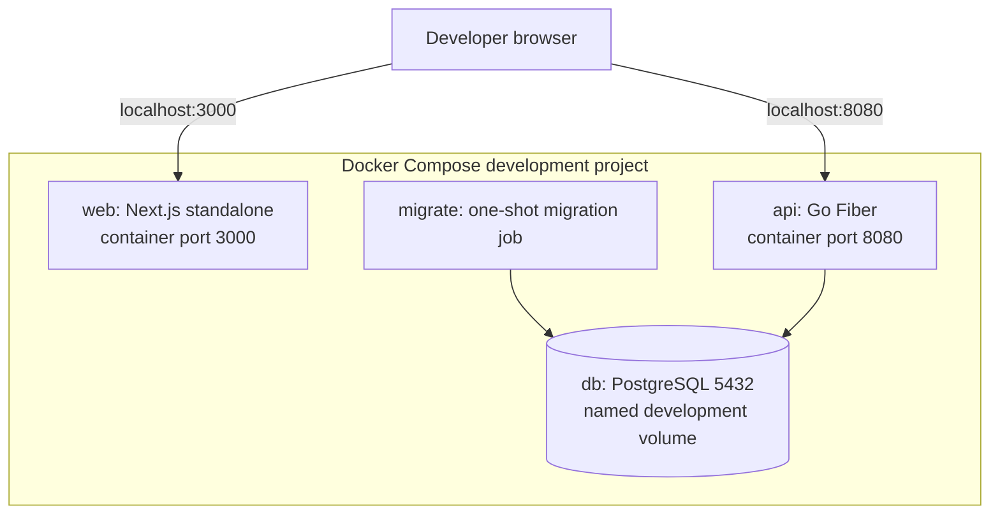

# Food Store Calculator System Design

## Purpose and Decision Drivers

The Food Store Calculator is a single-context system that accepts a Customer's Order, calculates its authoritative price, commits it, and returns an immutable Receipt. The design prioritizes correct pricing, atomic Red availability, safe retries, explicit behavior, and a small number of deep Modules over framework-shaped layers.

The v1 system deliberately excludes price quotes, payments, authentication, inventory counts, Order lookup, catalog administration, server-side or shared caches, queues, and event-driven processing. The frontend still uses the approved TanStack React Query client cache for the Product catalog.

## System Context



The browser calls the Go API directly. Next.js Route Handlers do not proxy API traffic. PostgreSQL is the source of truth for the Product Catalog, accepted Orders, idempotency, and the Red Availability Window.

## Authoritative Invariants

- **Calculate & Place Order is a command, not a quote.** A successful `POST /api/v1/orders` both calculates and commits one Order before returning `201 Created`.
- **The API is the only pricing authority.** The browser sends Product codes, quantities, and an optional Member Card number; it never sends an authoritative price or discount.
- **Money is integer satang.** All application and persistence amounts use checked `int64`/`bigint` arithmetic; floating-point money is forbidden.
- **A Receipt is immutable.** Accepted Order Lines retain Product name, display order, Unit Price, quantity, and discount snapshots even if the Product Catalog changes later.
- **A successful response follows commit.** No Order is reported as accepted until its database transaction commits.
- **Red is store-wide.** A Red Order advances one shared Red gate for exactly 60 minutes. At `available_at`, a new Red Order is eligible.
- **A failed Order changes nothing.** Validation, Red conflict, persistence failure, cancellation, or commit failure leaves no Order, idempotency binding, or Red gate update.
- **An accepted intent is idempotent.** The same Idempotency Key and canonical Order Intent returns the original Receipt and `201` without repricing or rechecking Red. The same key with a different intent is a conflict.
- **Sensitive input is transient.** A raw Member Card number is never persisted, returned, or logged.

## Product Catalog

A migration seeds exactly these rows. `display_order` is the stable order returned by the Product endpoint; Pair eligibility remains an explicit Pricing Module rule rather than mutable catalog data.

| Display order | Product Code | Name | Unit Price (satang) | Currency | Color token | Pair eligible |
| ---: | --- | --- | ---: | --- | --- | --- |
| 1 | `RED` | Red set | 5,000 | `THB` | `red` | No |
| 2 | `GREEN` | Green set | 4,000 | `THB` | `green` | Yes |
| 3 | `BLUE` | Blue set | 3,000 | `THB` | `blue` | No |
| 4 | `YELLOW` | Yellow set | 5,000 | `THB` | `yellow` | No |
| 5 | `PINK` | Pink set | 8,000 | `THB` | `pink` | Yes |
| 6 | `PURPLE` | Purple set | 9,000 | `THB` | `purple` | No |
| 7 | `ORANGE` | Orange set | 12,000 | `THB` | `orange` | Yes |

## Module Design

The public Interface of each Module is also its primary test surface. Internal details stay local so a pricing or transaction change is fixed once and benefits every caller.

| Module | Interface | Implementation hidden behind the Interface | Seam and Adapter | Depth, Leverage, and Locality |
| --- | --- | --- | --- | --- |
| Order Calculator Module | Render Products and an Order Draft; accept quantity, Member Card, retry, and New Order actions; render a Receipt or actionable failure | Draft state, intent identity, idempotency-key lifecycle, React Query read/mutation state, submission lock, and recovery states | The JSON/HTTP seam uses the single configured Axios Adapter | Callers learn one workflow while loading, retries, locking, and recovery remain local |
| Product Catalog Module | `ListProducts(ctx) -> []Product` ordered by `display_order` | Product query, row validation, and public representation | Fiber is the inbound HTTP Adapter; the concrete PostgreSQL Adapter owns SQL | One read operation hides persistence and representation details without a generic repository Interface |
| Order Module | `PlaceOrder(ctx, command) -> Receipt` or a classified domain error | Structural domain validation, canonical intent, idempotency claim/replay, catalog snapshot, pricing orchestration, Red gate serialization, snapshots, and commit | Fiber is the inbound Adapter. The concrete PostgreSQL Adapter is an internal dependency at the database seam | One operation provides high Leverage while keeping transaction and concurrency knowledge local |
| Pricing Module | `Calculate(PricingInput) -> PricingBreakdown` or arithmetic error | Same-Product pairing, discount order, half-up rounding, totals, and invariant checks | This is an in-process Seam; callers use the pure implementation directly and no Adapter is needed | A small deterministic Interface concentrates every pricing rule and makes table-driven tests natural |
| PostgreSQL Module | Narrow concrete operations used by Catalog and Order implementations | Parameterized SQL, transaction lifecycle, row decoding, immutable snapshot writes, and error classification | The PostgreSQL wire protocol is the external Seam; the production and integration-test database instances are Adapters at that Seam | SQL and transaction behavior stay local; there is no pass-through repository layer or in-memory substitute for database concurrency |
| HTTP Transport Module | Versioned JSON endpoints, health endpoints, headers, status codes, and structured errors | Strict decoding, request limits, validation mapping, request IDs, response serialization, and timeouts | Fiber is the HTTP Adapter around the application Modules | Protocol concerns remain local and never enter Pricing or persistence logic |

The dependency direction is:

```text
Next.js Order Calculator Module
    -> configured Axios Adapter
        -> Fiber HTTP Transport Module
            -> Product Catalog Module
            -> Order Module
                -> Pricing Module
                -> concrete PostgreSQL Module
```

No generic repository, provider Interface, event bus, or server-side/shared cache is introduced. The Pricing Module is pure and directly callable. Database-risk tests use real PostgreSQL instead of adding a fake Adapter that could not reproduce row locks or rollback behavior.

## HTTP Surface

| Endpoint | Behavior |
| --- | --- |
| `GET /api/v1/products` | Returns the seven Products in `display_order`, including Product Code, name, Unit Price in satang, `THB`, display order, and color token |
| `POST /api/v1/orders` | Requires `Idempotency-Key`, strictly validates an Order Intent, atomically accepts it, and returns the committed Receipt with `201` |
| `GET /health/live` | Reports whether the API process is running; it does not query dependencies |
| `GET /health/ready` | Uses a short deadline to verify PostgreSQL connectivity and that required migrations are present |

`POST /api/v1/orders` accepts one to seven unique lines, each with a supported Product Code and an integer quantity from 1 through 999. It rejects an empty Order, duplicate or unknown Products, malformed JSON, unknown JSON fields, invalid quantities, and an absent or invalid Idempotency Key. A key is 1-128 printable ASCII characters; UUID is the recommended client format.

## Placement Sequence



The frontend disables editing and submission while the mutation is pending. A network failure leaves the outcome unknown, so a manual retry of the unchanged intent reuses the same key. Any quantity edit, change between absent and present Member Card, or New Order action creates a new intent and a new key.

## Exact Pricing Flow

The Pricing Module receives validated Product snapshots and unique Order Lines. It performs every multiplication and addition with overflow checks before accepting the result.

For each Order Line with quantity `q` and Unit Price `p`:

1. `line_subtotal = q * p`.
2. For `GREEN`, `PINK`, and `ORANGE`, `pair_count = floor(q / 2)`; every other Product has zero Pairs.
3. `pair_base = pair_count * 2 * p`.
4. `line_pair_discount = round_half_up(pair_base * 5 / 100)`. Rounding occurs independently for each eligible Product, then the line discounts are summed.
5. `line_total_after_pair = line_subtotal - line_pair_discount`. Any odd remaining set stays at full Unit Price.

For the Order:

1. `total_before_discount` is the checked sum of all `line_subtotal` values.
2. `pair_discount_total` is the checked sum of all `line_pair_discount` values.
3. `total_after_pair = total_before_discount - pair_discount_total`.
4. The Member Card input is trimmed. If it is non-empty, `member_discount = round_half_up(total_after_pair * 10 / 100)`; otherwise it is zero.
5. `final_total = total_after_pair - member_discount`.

For non-negative integer values, `round_half_up(numerator / denominator)` is `floor((numerator + floor(denominator / 2)) / denominator)`. The implementation checks for overflow before scaling by 5 or 10. It rejects an arithmetic result that cannot fit in signed 64-bit satang.

The invariant is always:

```text
final_total
  = total_before_discount
  - pair_discount_total
  - member_discount
```

Reference cases, all in satang:

| Order | Total Before Discount | Pair Discount | Member Discount | Final Total |
| --- | ---: | ---: | ---: | ---: |
| Orange x2 | 24,000 | 1,200 | 0 | 22,800 |
| Pink x4 | 32,000 | 1,600 | 0 | 30,400 |
| Green x3 | 12,000 | 400 | 0 | 11,600 |
| Orange x2 with Member Card | 24,000 | 1,200 | 2,280 | 20,520 |

The Member Discount remains Order-level; it is not allocated back to Order Lines. The browser displays the returned breakdown and does not reproduce these formulas.

## PostgreSQL Schema

Versioned migrations create and seed the schema. Development never relies on manual schema changes.

### `products`

| Column | Type and constraints | Purpose |
| --- | --- | --- |
| `code` | `text primary key`, constrained to the seven Product Codes | Stable Product identity |
| `name` | `text not null` | Customer-facing Product name |
| `unit_price_satang` | `bigint not null check (unit_price_satang > 0)` | Authoritative Unit Price |
| `currency` | `char(3) not null check (currency = 'THB')` | Currency invariant |
| `display_order` | `smallint not null unique check (display_order > 0)` | Stable presentation order |
| `color_token` | `text not null` | Non-authoritative visual accent token |

### `orders`

| Column | Type and constraints | Purpose |
| --- | --- | --- |
| `id` | `uuid primary key` | Public Order reference; generated before the transaction claim |
| `placed_at` | `timestamptz not null` | Acceptance time from PostgreSQL |
| `currency` | `char(3) not null check (currency = 'THB')` | Receipt currency snapshot |
| `member_discount_applied` | `boolean not null` | Records Member presence without the Member Card number |
| `total_before_discount_satang` | `bigint not null check (... >= 0)` | Receipt total before deductions |
| `pair_discount_satang` | `bigint not null check (... >= 0)` | Sum of Pair Discounts |
| `member_discount_satang` | `bigint not null check (... >= 0)` | Order-level Member Discount |
| `final_total_satang` | `bigint not null check (... >= 0)` | Final Total, with a check equating it to the other totals |

### `order_lines`

| Column | Type and constraints | Purpose |
| --- | --- | --- |
| `order_id` | `uuid not null references orders(id) on delete restrict` | Owning Order |
| `product_code` | `text not null` | Product Code snapshot |
| `product_name` | `text not null` | Product name snapshot |
| `display_order` | `smallint not null` | Display order snapshot |
| `quantity` | `integer not null check (quantity between 1 and 999)` | Accepted quantity |
| `unit_price_satang` | `bigint not null check (... > 0)` | Unit Price snapshot |
| `line_subtotal_satang` | `bigint not null check (... >= 0)` | Quantity times Unit Price |
| `pair_count` | `integer not null check (pair_count >= 0)` | Complete eligible Pairs |
| `pair_discount_satang` | `bigint not null check (... >= 0)` | Per-Product Pair Discount snapshot |
| `line_total_after_pair_satang` | `bigint not null check (... >= 0)` | Line subtotal after Pair Discount |

The primary key is `(order_id, product_code)`. A check enforces `line_total_after_pair_satang = line_subtotal_satang - pair_discount_satang`. Snapshot columns intentionally do not foreign-key `product_code` to the mutable Product row.

### `order_idempotency`

| Column | Type and constraints | Purpose |
| --- | --- | --- |
| `key_digest` | `bytea primary key`, 32-byte check | SHA-256 digest of the Idempotency Key; the raw key is not stored |
| `intent_digest` | `bytea not null`, 32-byte check | SHA-256 digest of the canonical Order Intent |
| `order_id` | `uuid not null unique references orders(id) deferrable initially deferred` | Accepted Order bound to the key |
| `created_at` | `timestamptz not null` | PostgreSQL time at claim |

The deferred foreign key allows the transaction to reserve a new key with a pre-generated Order UUID before inserting the final Order. A transaction cannot commit a key without its accepted Order.

### `red_availability_gate`

| Column | Type and constraints | Purpose |
| --- | --- | --- |
| `product_code` | `text primary key check (product_code = 'RED')` | Enforces one singleton gate row |
| `available_at` | `timestamptz not null` | Earliest database time at which another Red Order may be accepted |

The seed value for `available_at` is PostgreSQL `-infinity`. A missing gate row is a dependency/integrity failure, never implicit availability.

## Canonical Intent and Idempotency

Before opening a transaction, the Order Module rejects structural errors and derives Member presence from the trimmed Member Card input. It then creates a versioned canonical representation containing:

- Product Code and quantity pairs sorted by Product Code;
- the Member-present boolean; and
- a canonical-format version prefix.

Duplicate Product Codes are rejected rather than combined. Item order and surrounding Member Card whitespace therefore do not change intent identity. The raw Member Card value is discarded after presence is derived. The Module hashes the canonical bytes and the raw Idempotency Key separately with SHA-256 and persists only the digests.

The canonical bytes are UTF-8 and use this exact v1 form: `v1\n`, then `member=0\n` or `member=1\n`, then one `PRODUCT_CODE=quantity\n` line per Product in Product Code sort order. Product Codes come from the fixed catalog and quantities are canonical base-10 integers, so this representation is unambiguous. The key digest hashes the validated ASCII header value exactly.

Within one PostgreSQL transaction at `READ COMMITTED`:

1. Generate the public Order UUID.
2. Attempt `INSERT ... ON CONFLICT DO NOTHING RETURNING order_id` into `order_idempotency` using the key digest, intent digest, and UUID.
3. If the insert wins, continue as the owner of that key. PostgreSQL uniqueness makes concurrent contenders wait for this transaction's commit or rollback.
4. If the key already committed, read its intent digest and immutable Order snapshots. A matching digest returns the original Receipt and `201`; it does not load current Product prices or lock the Red gate. A different digest rolls back and returns an idempotency conflict.
5. For a new key, validate Products against authoritative rows, calculate pricing, apply the Red algorithm when needed, insert snapshots, and commit. Because the foreign key is deferred, the reserved key becomes valid when its Order is inserted.

Only accepted Orders retain an idempotency binding. Any failed transaction rolls back the new claim, allowing an explicit retry with the same key. If the response is lost after commit, retry observes the committed binding and returns the original Receipt.

## Atomic Red Availability Algorithm

The Red gate is touched only for a new Order Intent containing `RED`; non-Red Orders never wait on it. After pricing and before persistence, the same Order transaction performs:

```text
SELECT available_at
FROM red_availability_gate
WHERE product_code = 'RED'
FOR UPDATE;

SELECT clock_timestamp();
```

Reading `clock_timestamp()` after acquiring the row lock means a request that waited for another transaction is judged using fresh PostgreSQL time, not application time or transaction-start time.

- If `database_now < available_at`, the Module records the timestamp for the safe conflict response and rolls back. Equality is accepted.
- If `database_now >= available_at`, it uses that same value as the Red Order's `placed_at`, updates `available_at = database_now + interval '60 minutes'`, then inserts the Order and Order Lines. A non-Red Order reads PostgreSQL time immediately before its insert.
- It commits the key claim, Red gate update, Order, and snapshots together.

The singleton row lock serializes Red Orders across goroutines and API instances. For different idempotency keys, at most one simultaneous Red Order sees the gate available. For the same key, the idempotency claim serializes first; followers replay the winner without consuming another window. Any error after the gate update rolls it back with the Order.

## Failure Semantics and Recovery

| Condition | Public outcome | State change | Frontend behavior |
| --- | --- | --- | --- |
| Malformed JSON, unknown field, or invalid key header | Client error with stable code | None | Preserve the Order Draft and identify the correction |
| Empty, duplicate, unknown, or invalid Order Line | Validation error with field details | None | Preserve and focus the relevant control |
| Red unavailable | `409` Red conflict with `available_at` in RFC 3339 | None | Preserve the draft, show local availability time, and allow Red removal or later retry |
| Key reused for a different intent | `409` idempotency conflict | None | Do not retry automatically; create a new intent/key after an edit or New Order |
| Network interruption | Outcome may be unknown | Unknown to browser | Preserve the draft and manually retry with the same key |
| PostgreSQL unavailable, transaction failure, commit failure, or readiness failure | `503 SERVICE_UNAVAILABLE` | Transaction rolls back or no transaction starts | Preserve the draft and offer manual retry with the same key when the outcome is unknown |
| Arithmetic invariant or unexpected application failure | `500 INTERNAL_ERROR` with request ID | Transaction rolls back | Preserve the draft; never claim acceptance |

Errors contain a stable machine code and safe message. Validation-class errors require `field_errors`; `RED_UNAVAILABLE` alone requires `available_at`; other errors contain neither field. Internal SQL errors, stack traces, and credentials never cross the HTTP seam. Order mutations have no automatic React Query retry.

## Security and Privacy

- Strict JSON decoding rejects unknown fields and trailing documents. Request body and header sizes are bounded before decoding.
- SQL is parameterized; Product codes are values, never identifiers interpolated into SQL.
- The API ignores any client-supplied price, discount, total, availability, or acceptance time.
- Raw Member Card numbers, request bodies, raw Idempotency Keys, database credentials, and stack traces are excluded from logs.
- Only `member_discount_applied` is retained; the Member Card value is discarded in process after trimming and deriving presence.
- Browser-visible configuration contains only the public API origin. Database credentials and other secrets remain server-side environment variables.
- CORS permits only the configured web origin and required methods/headers. Production TLS terminates before the web and API processes.
- The API generates or validates a request ID for correlation and uses route templates rather than unbounded URLs in telemetry.
- v1 has no Customer authentication; deployment must therefore treat Order placement as a deliberately public store operation and apply network-level rate limits where exposed.

## Local Docker Topology



The `db` health check gates the one-shot migration job; successful migrations gate API startup; API readiness gates web startup. Only web and API ports are published by default. Containers share a private Compose network, and the API connects to PostgreSQL by service name.

Tests use a separate Compose project, PostgreSQL container, database name, credentials, network, and disposable volume. They never reuse the development volume. A clean migration run and deterministic seven-Product seed are prerequisites to integration and browser tests.

## Observability

- Liveness checks process health only; readiness checks PostgreSQL with a short timeout and verifies the expected migration version.
- Structured request logs include timestamp, request ID, route template, method, status class, duration, and stable error code. Successful Order logs may include the generated Order reference, but never sensitive inputs.
- Fixed-label counters cover accepted Orders, idempotent replays, Red conflicts, idempotency conflicts, validation failures, and transaction failures.
- Histograms cover HTTP duration and Order transaction duration. Labels remain low-cardinality; request IDs, Order references, keys, and Member data are never metric labels.
- Database errors are wrapped with operation context for internal logs and mapped to user-safe public errors.
- Graceful shutdown stops accepting new work, propagates context cancellation, and lets in-flight transactions commit or roll back within a bounded deadline.

Distributed tracing infrastructure is out of scope for v1; request IDs provide end-to-end correlation across the web and API logs.

## Test Architecture

The highest and primary Seam is `POST /api/v1/orders`; tests assert observable status, stable error codes, Receipt values, persistence outcome, replay behavior, and Red behavior rather than private calls or SQL text.

| Test layer | Seam and Adapter | Required proof |
| --- | --- | --- |
| Pricing unit tests | Direct Pricing Module Interface; no Adapter | Every Product, eligible quantities 0-4, odd sets, mixed Products, Member ordering, half-up rounding, overflow rejection, reference cases, and Final Total invariant |
| HTTP contract tests | Fiber HTTP Adapter through real request/response | Strict JSON/header validation, exact Product catalog, Order errors, successful `201`, same-key `201` replay, mismatch conflict, and safe error shape |
| PostgreSQL integration tests | Order Module with a freshly migrated real PostgreSQL Adapter | Commit/rollback, immutable snapshots, concurrent identical keys, different intents, missing gate failure, and multiple API-instance behavior |
| Red concurrency tests | At least ten simultaneous HTTP Order attempts with distinct keys | Exactly one Red success; every other Red attempt conflicts; non-Red Orders continue |
| Red boundary tests | Gate timestamps written with PostgreSQL time | Block before `available_at`, accept at or after the exact timestamp, and restore availability after a later transaction failure |
| Frontend component tests | Order Calculator Module with controlled HTTP responses | Loading/empty/failure states, quantity zero floor, submission lock, preserved drafts, Receipt lock, New Order, manual retry key reuse, and new key after edits |
| Playwright and accessibility | Real browser against the real local stack | Normal Order, combined Pair and Member Discounts, Red recovery, keyboard flow, accessible names, announcements, contrast, 200% zoom, axe checks, and mobile/desktop screenshots |

Backend verification runs `go test -race ./...`. Frontend verification runs formatting, linting, type checking, unit/component tests, and the production build. Full-stack verification starts from a clean test database, applies every migration, and runs contract, integration, and Playwright suites against the real processes.

Tests replace behavior only at real Seams. They do not introduce a fake PostgreSQL repository for the transaction path, assert Tailwind classes or Axios internals, or reach through a Module Interface to private implementation details.
